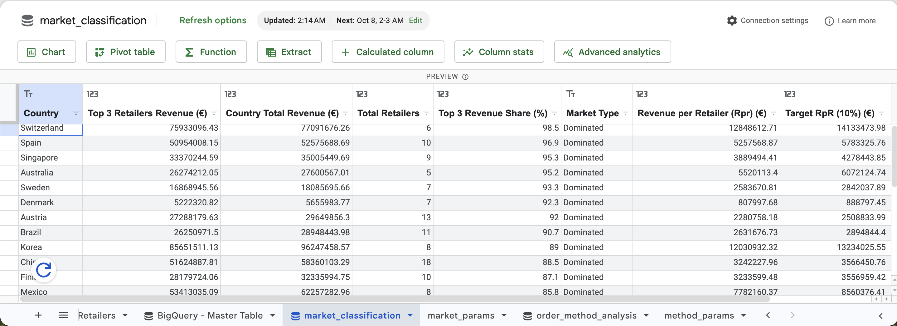
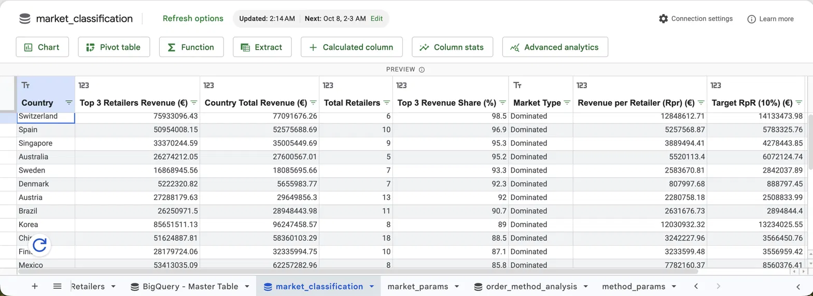
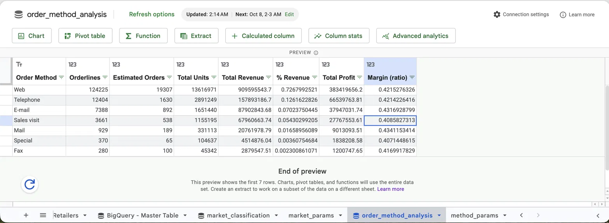

# Google Sheets

The first version of the master table was built in Google Sheets (before moving to BigQuery). Later, Google Sheets was connected to BigQuery with Connected Sheets, so the analysis updates automatically.

## Connected Sheets (BigQuery)

### Master table


### Market classification
Top 3 retailers share by country, market type and growth targets, filtered by a date range.



### Order method analysis
Revenue, share, profit, estimated orders and margin per order method.



Date range parameters: two cells with plain-text dates (`YYYY-MM-DD`), linked as `@start_date` and `@end_date`. The queries are in `sql/06_connected_sheets_queries.sql`.

## Formulas used in the first version
Column letters depend on your layout; adjust them.

**Estimated order ID** (retailer code + date + order method; product is excluded on purpose):
```
=ARRAYFORMULA(IF(B2:B="","",B2:B&"-"&TEXT(E2:E,"yyyymmdd")&"-"&D2:D))
```
Count unique orders with `=COUNTUNIQUE(A2:A)`.

**Lookups (no dragging needed):**
```
=ARRAYFORMULA(VLOOKUP(B2:B, Retailers!$A$2:$D$563, {2,3,4}, FALSE))
=ARRAYFORMULA(VLOOKUP(C2:C, Products!$A$2:$H$275, {2,3,4,5,6,7}, FALSE))
```

**Calculated columns:**
```
Margin:     =IF(X2=0,"",Z2/X2)
Year:       =YEAR(D2)
Month:      =MONTH(D2)
Quarter:    ="Q"&ROUNDUP(MONTH(D2)/3,0)
Month name: =TEXT(D2,"mmmm")
Share in country (helper): =D2/SUMIF($A:$A, A2, $D:$D)
```

**Pivot tables:** rows by order method or country; values with SUM of revenue and profit, COUNTUNIQUE of order ID, and a calculated field for margin.
